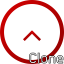

<!--
*** Thanks for checking out the EveryTimeClone. If you have a suggestion
*** that would make this better, please fork the repo and create a pull request
*** or simply open an issue with the tag "enhancement".
*** Thanks again! Now go create something AMAZING! :D
-->


<!-- PROJECT SHIELDS -->
<!--
*** I'm using markdown "reference style" links for readability.
*** Reference links are enclosed in brackets [ ] instead of parentheses ( ).
*** See the bottom of this document for the declaration of the reference variables
*** for contributors-url, forks-url, etc. This is an optional, concise syntax you may use.
*** https://www.markdownguide.org/basic-syntax/#reference-style-links
-->
[![Contributors][contributors-shield]][contributors-url]
[![Forks][forks-shield]][forks-url]
[![Stargazers][stars-shield]][stars-url]
[![Issues][issues-shield]][issues-url]


<!-- PROJECT LOGO -->
<br />
<p align="center">
  <a href="https://github.com/WooGeun-Nam/EveryTimeClone">
    
  </a>

  <h3 align="center">Everytime Clone Coding Project</h3>

  <p align="center">
    EveryTime의 기능을 자바언어로 직접 작성해본 프로젝트입니다.
    <br />
    <a href="https://github.com/WooGeun-Nam/EveryTimeClone"><strong>Explore the docs »</strong></a>
    <br />
    <br />
    <a href="https://github.com/WooGeun-Nam/EveryTimeClone">View Demo</a>
    ·
    <a href="https://github.com/WooGeun-Nam/EveryTimeClone/issues">Report Bug</a>
    ·
    <a href="https://github.com/WooGeun-Nam/EveryTimeClone/issues">Request Feature</a>
  </p>
</p>


<!-- TABLE OF CONTENTS -->
<details open="open">
  <summary>목 차</summary>
  <ol>
    <li>
      <a href="#about-the-project">프로젝트에 대해서</a>
      <ul>
        <li><a href="#built-with">개발 언어 및 도구</a></li>
      </ul>
    </li>
    <li>
      <a href="#getting-started">실행 방법</a>
      <ul>
        <li><a href="#installation">Installation</a></li>
      </ul>
    </li>
    <li><a href="#usage">프로젝트 데모</a></li>
    <li><a href="#roadmap">로드맵</a></li>
  </ol>
</details>


<!-- ABOUT THE PROJECT -->
## 프로젝트에 대해서

[Product Name Screen Shot][product-screenshot]

There are many great README templates available on GitHub, however, I didn't find one that really suit my needs so I created this enhanced one. I want to create a README template so amazing that it'll be the last one you ever need -- I think this is it.

개발 목적:
* Your time should be focused on creating something amazing. A project that solves a problem and helps others
* You shouldn't be doing the same tasks over and over like creating a README from scratch
* You should element DRY principles to the rest of your life :smile:

Of course, no one template will serve all projects since your needs may be different. So I'll be adding more in the near future. You may also suggest changes by forking this repo and creating a pull request or opening an issue. Thanks to all the people have have contributed to expanding this template!

A list of commonly used resources that I find helpful are listed in the acknowledgements.

### 개발 언어 및 도구

DB서버는 MySQL을 이용하여 구축 하였고, 개발 IDE는 Netbeans로 통일 하였으며 전체 개발언어는 100% Java 로 작성되었습니다.
* [Java](https://www.java.com)
* [Netbeans](https://netbeans.apache.org)
* [MySQL](https://www.mysql.com)


<!-- GETTING STARTED -->
## 실행 방법

This is an example of how you may give instructions on setting up your project locally.
To get a local copy up and running follow these simple example steps.

### Installation

1. Get a free API Key at [https://example.com](https://example.com)
2. Clone the repo
   ```sh
   git clone https://github.com/your_username_/Project-Name.git
   ```
3. Install NPM packages
   ```sh
   npm install
   ```
4. Enter your API in `config.js`
   ```JS
   const API_KEY = 'ENTER YOUR API';
   ```


<!-- USAGE EXAMPLES -->
## 프로젝트 데모

실제 작동 사진 추가


<!-- ROADMAP -->
## 로드맵

[open issues](https://github.com/WooGeun-Nam/EveryTimeClone/issues) 
미해결 문제 및 기능 제안.


<!-- MARKDOWN LINKS & IMAGES -->
<!-- https://www.markdownguide.org/basic-syntax/#reference-style-links -->
[contributors-shield]: https://img.shields.io/github/contributors/WooGeun-Nam/EveryTimeClone.svg?style=for-the-badge
[contributors-url]: https://github.com/WooGeun-Nam/EveryTimeClone/graphs/contributors
[forks-shield]: https://img.shields.io/github/forks/WooGeun-Nam/EveryTimeClone.svg?style=for-the-badge
[forks-url]: https://github.com/WooGeun-Nam/EveryTimeClone/network/members
[stars-shield]: https://img.shields.io/github/stars/WooGeun-Nam/EveryTimeClone.svg?style=for-the-badge
[stars-url]: https://github.com/WooGeun-Nam/EveryTimeClone/stargazers
[issues-shield]: https://img.shields.io/github/issues/WooGeun-Nam/EveryTimeClone.svg?style=for-the-badge
[issues-url]: https://github.com/WooGeun-Nam/EveryTimeClone/issues
[license-shield]: https://img.shields.io/github/license/WooGeun-Nam/EveryTimeClone.svg?style=for-the-badge
[license-url]: https://github.com/WooGeun-Nam/EveryTimeClone/blob/master/LICENSE.txt
[linkedin-shield]: https://img.shields.io/badge/-LinkedIn-black.svg?style=for-the-badge&logo=linkedin&colorB=555
[linkedin-url]: https://linkedin.com/in/WooGeun-Nam
[product-screenshot]: images/screenshot.png
